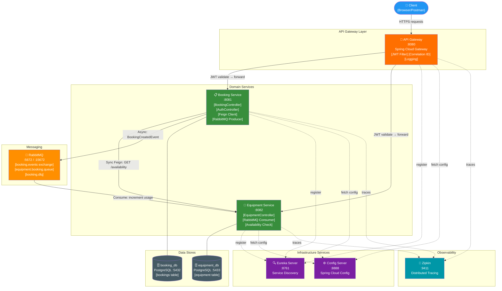

# University Lab Equipment Booking & Maintenance Platform

---

## Architecture Diagram



---

## Project Structure

```
microservices-lab-platform/
├── pom.xml                              # Root parent POM (Java 21, Spring Boot 3.3)
├── docker-compose.yml                   # Full 9-container orchestration
├── .env.example                         # Environment variable template
│
├── common-library/                      # Shared DTOs, events, exceptions
│   └── src/main/java/com/labplatform/common/
│       ├── dto/ApiResponse.java
│       ├── event/BookingCreatedEvent.java
│       └── exception/ApiErrorResponse.java
│
├── config-server/                       # Spring Cloud Config Server (port 8888)
│   ├── Dockerfile
│   ├── src/main/resources/
│   │   ├── application.yml
│   │   └── config-repo/                 # All service configurations
│   │       ├── application.yml          # Shared defaults
│   │       ├── booking-service-dev.yml
│   │       ├── booking-service-prod.yml
│   │       ├── equipment-service-dev.yml
│   │       ├── equipment-service-prod.yml
│   │       ├── gateway-dev.yml
│   │       └── gateway-prod.yml
│
├── eureka-server/                       # Netflix Eureka (port 8761)
│   ├── Dockerfile
│   └── src/main/java/com/labplatform/eurekaserver/
│       ├── EurekaServerApplication.java
│       └── config/EurekaSecurityConfig.java
│
├── api-gateway/                         # Spring Cloud Gateway (port 8080)
│   ├── Dockerfile
│   └── src/main/java/com/labplatform/gateway/
│       ├── ApiGatewayApplication.java
│       ├── filter/
│       │   ├── JwtAuthenticationFilter.java   # JWT validation
│       │   ├── CorrelationIdFilter.java        # Request correlation
│       │   └── RequestLoggingFilter.java       # Access logging
│       ├── controller/FallbackController.java  # Circuit breaker fallbacks
│       └── security/JwtUtil.java
│
├── booking-service/                     # Booking Domain Service (port 8081)
│   ├── Dockerfile
│   └── src/main/java/com/labplatform/booking/
│       ├── domain/
│       │   ├── Booking.java             # JPA Entity
│       │   └── BookingStatus.java       # Enum
│       ├── dto/
│       │   ├── CreateBookingRequest.java
│       │   ├── UpdateBookingRequest.java
│       │   ├── BookingResponse.java
│       │   ├── LoginRequest.java
│       │   └── TokenResponse.java
│       ├── repository/BookingRepository.java   # JPQL overlap queries
│       ├── mapper/BookingMapper.java           # MapStruct
│       ├── service/BookingService.java         # Business logic
│       ├── controller/
│       │   ├── BookingController.java          # CRUD endpoints
│       │   └── AuthController.java             # Login/JWT issuance
│       ├── client/
│       │   ├── EquipmentClient.java            # Feign + Resilience4J
│       │   ├── EquipmentClientFallback.java    # Circuit breaker fallback
│       │   └── dto/AvailabilityResponse.java
│       ├── messaging/BookingEventPublisher.java # RabbitMQ producer
│       ├── filter/CorrelationIdMdcFilter.java   # MDC correlation ID from gateway
│       ├── config/
│       │   ├── FeignConfig.java
│       │   └── RabbitMQConfig.java
│       ├── security/
│       │   ├── JwtUtil.java
│       │   ├── JwtAuthenticationFilter.java
│       │   └── SecurityConfig.java
│       └── exception/
│           ├── GlobalExceptionHandler.java
│           ├── BookingNotFoundException.java
│           ├── BookingConflictException.java
│           ├── EquipmentNotFoundException.java
│           ├── EquipmentUnavailableException.java
│           └── ServiceUnavailableException.java
│
├── equipment-service/                   # Equipment Domain Service (port 8082)
│   ├── Dockerfile
│   └── src/main/java/com/labplatform/equipment/
│       ├── domain/
│       │   ├── Equipment.java           # JPA Entity
│       │   ├── EquipmentStatus.java
│       │   └── EquipmentCategory.java
│       ├── dto/
│       │   ├── CreateEquipmentRequest.java
│       │   ├── EquipmentResponse.java
│       │   └── AvailabilityResponse.java
│       ├── repository/EquipmentRepository.java
│       ├── mapper/EquipmentMapper.java
│       ├── service/EquipmentService.java
│       ├── controller/EquipmentController.java
│       ├── messaging/BookingEventConsumer.java  # RabbitMQ consumer
│       ├── filter/CorrelationIdMdcFilter.java   # MDC correlation ID from gateway
│       ├── config/RabbitMQConsumerConfig.java
│       ├── security/
│       │   ├── JwtUtil.java
│       │   ├── JwtAuthenticationFilter.java
│       │   └── SecurityConfig.java
│       └── exception/GlobalExceptionHandler.java
│
├── docker/
│   └── sql/
│       ├── booking-db-init.sql          # booking_db DDL + seed data
│       └── equipment-db-init.sql        # equipment_db DDL + seed data
│
└── docs/
    └── adr/
        ├── ADR-001-Gateway-Centred-Security.md
        ├── ADR-002-Event-Driven-Communication.md
        └── ADR-003-Resilience-Failure-Handling.md
```

---

## Quick Start

### Prerequisites
- Docker Desktop 4.x+
- Java 21 (for local development)
- Maven 3.9+

### Run with Docker Compose (Recommended)

```bash
# 1. Clone and enter directory
cd microservices-lab-platform

# 2. Copy environment template
cp .env.example .env
# Edit .env to set JWT_SECRET and passwords (REQUIRED for production)

# 3. Start all services
docker-compose up -d

# 4. Wait for startup (~2-3 minutes for full startup chain)
docker-compose logs -f

# 5. Verify all services are up
docker-compose ps
```

### Service URLs

| Service | URL | Credentials | Notes |
|---------|-----|-------------|-------|
| **API Gateway** | http://localhost:8080 | — | ⬅️ Use this for ALL API calls |
| Eureka Dashboard | http://localhost:8761 | eurekauser / eurekapass | — |
| RabbitMQ Management | http://localhost:15672 | guest / guest | — |
| Zipkin UI | http://localhost:9411 | — | — |
| Config Server | http://localhost:8888 | configuser / configpass | — |
| Redis | localhost:6379 | — | Internal — rate limiter (prod profile) |

> ⚠️ **Important**: Booking Service (`8081`) and Equipment Service (`8082`) ports are **not exposed externally** in this deployment. All client requests must go through the API Gateway on port `8080`. This enforces the gateway-first security model.

---

## API Reference

### Authentication

```bash
# Login as student (ROLE_USER)
curl -X POST http://localhost:8080/api/auth/login \
  -H "Content-Type: application/json" \
  -d '{"username": "student", "password": "student123"}'

# Response:
{
  "success": true,
  "data": {
    "accessToken": "eyJhbGciOiJIUzI1NiJ9...",
    "tokenType": "Bearer",
    "expiresIn": 86400,
    "username": "student",
    "role": "ROLE_USER"
  }
}
```

### Booking Service Endpoints

```bash
# Create a booking (USER or ADMIN)
curl -X POST http://localhost:8080/api/bookings \
  -H "Authorization: Bearer <token>" \
  -H "Content-Type: application/json" \
  -d '{
    "equipmentId": 1,
    "startTime": "2024-12-01T10:00:00",
    "endTime": "2024-12-01T12:00:00",
    "notes": "Lab 3 oscilloscope session"
  }'

# Get all bookings
curl http://localhost:8080/api/bookings \
  -H "Authorization: Bearer <token>"

# Get booking by ID
curl http://localhost:8080/api/bookings/1 \
  -H "Authorization: Bearer <token>"

# Update booking (ADMIN only)
curl -X PUT http://localhost:8080/api/bookings/1 \
  -H "Authorization: Bearer <admin-token>" \
  -H "Content-Type: application/json" \
  -d '{"status": "CONFIRMED"}'

# Cancel booking (ADMIN only)
curl -X DELETE http://localhost:8080/api/bookings/1 \
  -H "Authorization: Bearer <admin-token>"
```

### Equipment Service Endpoints

```bash
# List all equipment
curl http://localhost:8080/api/equipment \
  -H "Authorization: Bearer <token>"

# Check availability
curl http://localhost:8080/api/equipment/1/availability \
  -H "Authorization: Bearer <token>"
# Response: { "available": true, "equipmentId": 1, "reason": "...", "status": "AVAILABLE" }

# Create equipment (ADMIN only)
curl -X POST http://localhost:8080/api/equipment \
  -H "Authorization: Bearer <admin-token>" \
  -H "Content-Type: application/json" \
  -d '{
    "name": "New Oscilloscope",
    "category": "ELECTRONIC_MEASUREMENT",
    "serialNumber": "OSC-NEW-001",
    "location": "Lab 101"
  }'
```

---

## Security Design

### JWT Token Claims

```json
{
  "sub": "student",
  "role": "ROLE_USER",
  "iat": 1700000000,
  "exp": 1700086400
}
```

### Authentication Flow

```
1. POST /api/auth/login {username, password}
        ↓
2. AuthenticationManager validates against InMemoryUserDetailsManager
        ↓
3. JwtUtil.generateToken(username, role) → HS256 signed JWT
        ↓
4. TokenResponse returned with accessToken
        ↓
5. Client includes "Authorization: Bearer <token>" in subsequent requests
        ↓
6. Gateway JwtAuthenticationFilter validates token
        ↓
7. Gateway forwards X-Auth-Username + X-Auth-Role headers to downstream
        ↓
8. Downstream service's JwtAuthenticationFilter trusts headers
        ↓
9. @PreAuthorize("hasRole('ADMIN')") enforced at method level
```

---

## Observability

### Distributed Trace Flow

```
Client → Gateway → Booking Service → Equipment Service → RabbitMQ Consumer
   │         │              │                │                    │
   └─────────┴──────────────┴────────────────┴────────────────────┘
                     Single Trace ID propagated via:
                     - HTTP Header: traceparent / b3
                     - RabbitMQ message: event.traceId field
                     → All visible in Zipkin at http://localhost:9411
```

### Structured Log Format

```
2024-06-17 11:15:23.456 [http-nio-8081-exec-1] INFO  [traceId=abc123def456 spanId=789012] 
com.labplatform.booking.service.BookingService - Creating booking for equipmentId=1 by userId=student
```

### Correlation ID Header

Every request through the gateway receives an `X-Correlation-Id` header:
- Generated if not present in incoming request
- Propagated to all downstream services
- Echoed back in response headers
- Visible in all structured logs

---

## Requirement-to-Implementation Mapping

| Requirement | Implementation | File(s) |
|------------|---------------|---------|
| Spring Boot 3.x | Spring Boot 3.3.0 | pom.xml |
| Java 21 | Java 21 target | pom.xml |
| Config Server | Spring Cloud Config (native) | config-server/ |
| Eureka | Netflix Eureka Server | eureka-server/ |
| API Gateway | Spring Cloud Gateway | api-gateway/ |
| OpenFeign | EquipmentClient interface | EquipmentClient.java |
| Resilience4J | Retry + CB + Timeout + Fallback | EquipmentClient.java, config YAMLs |
| RabbitMQ | Topic exchange + DLQ | RabbitMQConfig.java, consumers |
| JWT Security | HS256 + Role RBAC | JwtUtil, SecurityConfig |
| Spring Data JPA | Repository + JPQL | BookingRepository, EquipmentRepository |
| PostgreSQL | Two isolated databases | booking_db, equipment_db |
| OpenTelemetry | Micrometer-OTel bridge | pom.xml dependencies |
| Zipkin | OTel Zipkin exporter | management.zipkin config |
| Docker | Multi-stage Dockerfiles | */Dockerfile |
| Docker Compose | 9-service orchestration | docker-compose.yml |
| Dev profile | *-dev.yml in config-repo | config-repo/ |
| Prod profile | *-prod.yml in config-repo | config-repo/ |
| No hardcoded secrets | All via ${ENV_VAR} | All YAMLs |
| JWT_SECRET env var | ${JWT_SECRET} | All service YAMLs |
| DB creds env var | ${DB_USERNAME}, ${DB_PASSWORD} | Service YAMLs |
| Booking CRUD | POST/GET/PUT/DELETE | BookingController.java |
| Equipment CRUD | POST/GET/PUT/DELETE | EquipmentController.java |
| Availability check | GET /api/equipment/{id}/availability | EquipmentController.java |
| Double-booking prevention | Overlap detection JPQL | BookingRepository.java |
| BookingCreatedEvent | Event class + publisher/consumer | common-library/event/ |
| Correlation IDs | CorrelationIdFilter | Gateway filter |
| Structured logging | Logback pattern with traceId | All YAMLs |
| ADR-001 | Gateway-centred security | docs/adr/ADR-001 |
| ADR-002 | Event-driven communication | docs/adr/ADR-002 |
| ADR-003 | Resilience strategy | docs/adr/ADR-003 |
| DLQ strategy | booking.dlx + booking.dlq | RabbitMQConfig.java |
| Maintenance tracking | incrementUsage() on event | EquipmentService.java |
| Maintenance threshold | equipment.maintenance.usage-threshold: 10 | *-dev.yml |
